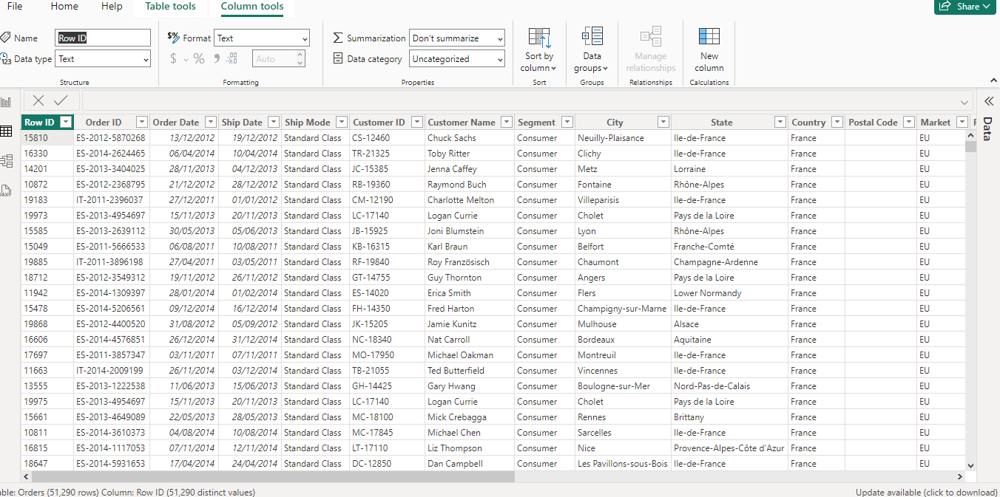
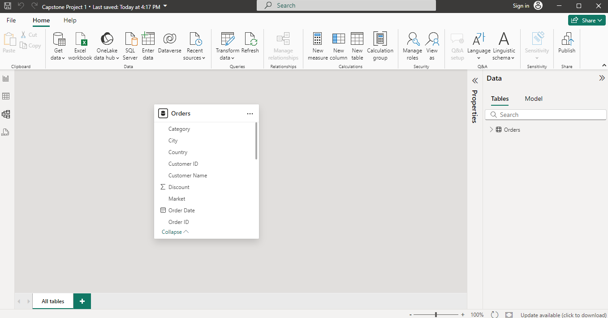
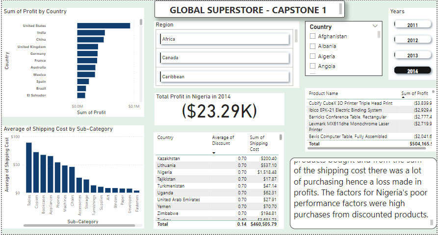
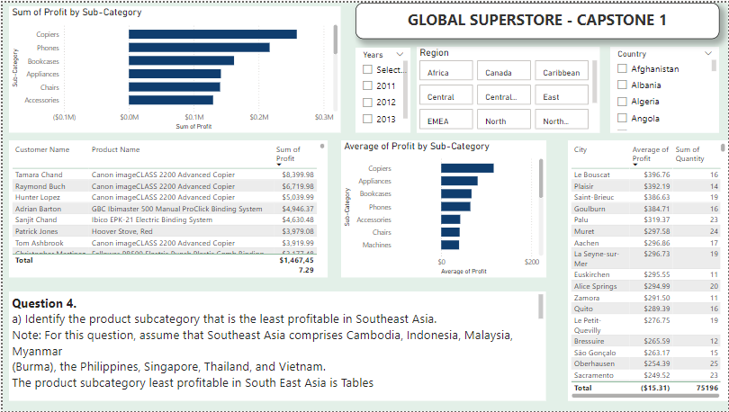
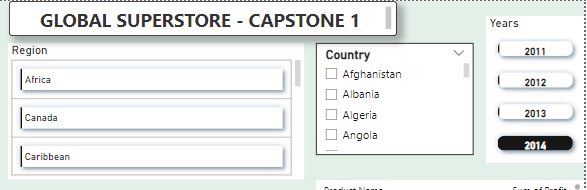
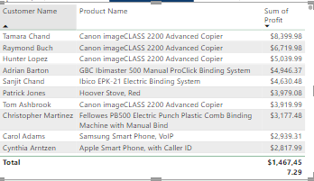
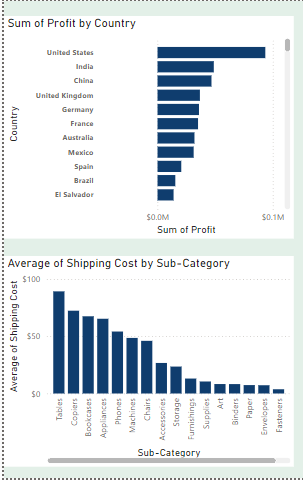

# Capstone Project 1

## Global Superstore

---

### Introduction

This is a power bi project to help the Global Superstore analyse and draw out meaningful insights for the superstore data set with the aim of helping management, make informed decisions to improve performance and profitability. 

### Problem Statement

1. a. What are the three countries that generated the highest total profits from Global super store in 2014? b. For each of these three countries. Find the three products with the highest total profit. Specifically, what are the products’ names and the total profit of each product? 
2. Identify the three sub categories with the highest average shipping cost In the United States.
3. a) Assess Nigeria's profitability for 2014. How does it compare to other African countries? What factors might be responsible for Nigeria's. Poor performance 
b) What factors might be responsible for Nigeria’s poor performance? You might want to investigate shipping costs and the average discount as potential root causes.
4. a) Identify the product subcategory that is the least profitable in Southeast Asia. Note: For this question, assume that Southeast Asia comprises Cambodia, Indonesia, Malaysia, Myanmar (Burma), the Philippines, Singapore, Thailand, and Vietnam. b) Is there a specific country in Southeast Asia where Global Superstore should stop offering the subcategory identified in 4a?
5. Which city is the least profitable In the United States.
6. Which category Has the highest average profits In Australia.
7. Who are the most valuable customers and what do they purchase? 

### Skill/Concepts Demonstrated

The following skill/concept were incorporated:
- Power query
- Data modelling
- Data cleaning
- Data visualization

Transformed Table
:-------------------------:

### Data Sourcing
Digitately Drive (https://docs.google.com/spreadsheets/d/1nxESpFzWjlGDMGDVLH69xmDzIl9l6OEq/edit#gid=633280281)
Thera are 3 tables but one was used for the analysis

### Data Modelling

Automatically derived relationships which can be adjusted to remove and replace unwanted relationships with the required.

Model View
:---------------:

This model has just one fact table 

### Visualisation 
The report comprises of 2 pages in the report view
1. Visualisation 1
2. Visualisation 2
(https://drive.google.com/file/d/1hoZ3HNoJiNTv6SDMenFiGTGcBC8lIPST/view?usp=drive_link)

Visualisation 1                        |           Visualisation 2
:-------------------------------------:|:-----------------------------:
               |    

The visuals report comprise of slicers, tables, cards, bar charts;
Slicers                   |     Table                 |    Card                 |   Bar chart
:------------------------:|:-------------------------:|:-----------------------:|:---------------------:
          | |            | 

Slicers - 
These are the main controllers of the visual. The narrow vast information to aid in getting more accurate answers for the problem statements

Tables - 
These visuals display large amount of data for which can be easily filtered for accurate results 

Cards - 
Display accurate numbers for the results against chosen slicers

Bar Charts - 
Provide changing but accurate results based off of values chosen in the slicers    

### Conclusion And Recommendation
- United States, India and China were there th countries that generated the highest total profit for Global Superstore in 2014
- The top 3 products sold in all 3 countries are as follows:
- United States - Canon Image Class 2200, Hewlett-Packard Deskjet 6988DT Refurbished Printer, 3D Systems Cube Printer, 2nd Generation, Magenta with 1351
- India - Sauder Classic Bookcase, Traditional, Cisco Smart Phone, with Caller ID, Hamilton Beach Refrigerator, Red
- China - Sauder Classic Bookcase, Metal; Bush Classic Bookcase, Mobile; HP Copy Machine, Color
- Tablets, Copiers, Bookcases are 3 subcategories with the highest average shipping cost in the United States.
- The total profit in Nigeria as of 2014 is -$23,290 dollars. As the compared to the other African countries is the was the least profitable country in African as of 2014.
- Nigeria had a high discount on products bought and from the sum of the shipping cost there was a lot of purchasing hence a loss made in profits. The factors for Nigeria's poor performance factors were high purchases from discounted products.

- The product subcategory least profitable in South East Asia is Tables.
- Global Superstore should stop offering tables to Cambodia as it is the highest bought product in the country from the Superstore.
- Burlington is the least profitable city in the United States of America. This is because most product bought in this city has discounts.
- Appliances had the highest average profit in Australia.
  
